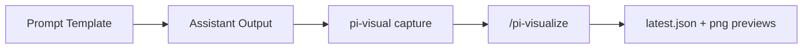

Use this exact markdown payload in your response (do not explain first):

# Visual Test Payload

This payload validates markdown + mermaid + numeric chart capture.

## Checklist

- [x] Headings
- [x] Lists
- [x] Table
- [x] Mermaid
- [x] Numeric chart table

| area | status |
|---|---|
| markdown | ok |
| mermaid | ok |
| chart | ok |

## Chart Sample (pi-charts style input via markdown table)

| step | ms |
|---|---:|
| parse | 18 |
| mermaid render | 42 |
| chart render | 15 |
| export json | 11 |

